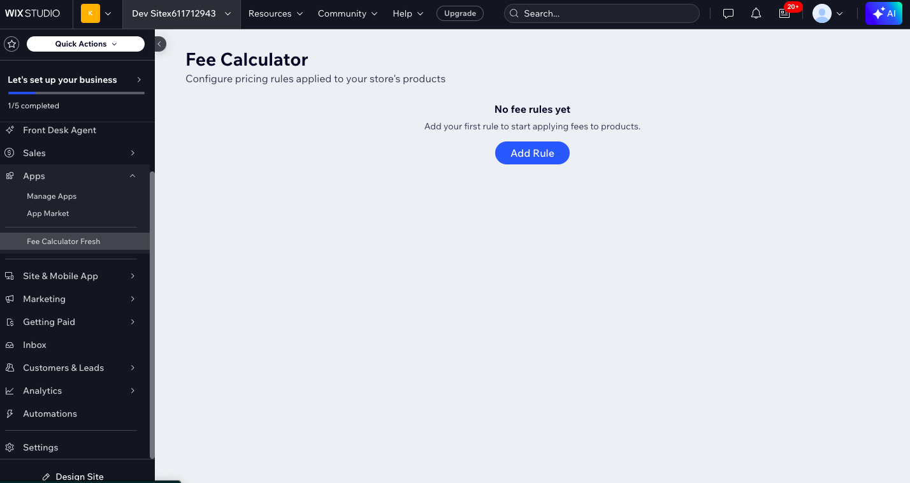
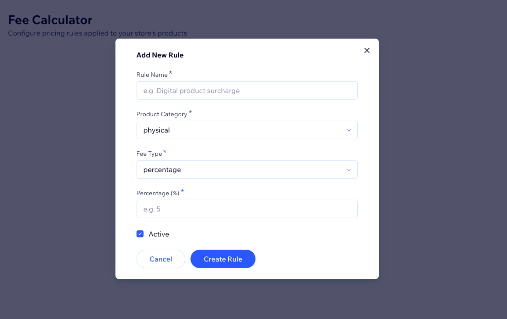

# 🧮 Dynamic Fee Calculator — Wix App Market Plugin


A full-stack Wix App Market plugin that allows Wix store merchants to configure
custom pricing rules and automatically calculate additional fees for their 
products and orders — all from inside their Wix dashboard.

---

## 🌐 Live Demo

- **Install on your Wix site:** [Click to Install](https://wix.to/reyEFUp)
- **Backend API:** https://backend-pi-six-60.vercel.app/health

---

## 📸 Screenshots




---


## 🧠 What Problem Does This Solve?

Wix stores by default have limited fee configuration options.
Merchants who need to charge:
- **Digital product surcharges** (e.g. licensing fees)
- **Handling fees** for physical products
- **Custom category-based fees**

...have no native way to do this in Wix. This plugin solves that by giving
merchants a clean dashboard to define their own pricing rules that get applied
automatically to their store.

---

## ✨ Features

- ✅ **Rules Dashboard** — View all configured fee rules in a clean table
- ✅ **Add/Edit/Delete Rules** — Full CRUD for fee rules
- ✅ **Rule Types** — Support for percentage-based and fixed amount fees
- ✅ **Product Categories** — Apply rules to Digital, Physical, or Custom products
- ✅ **Active/Inactive Toggle** — Enable or disable rules without deleting them
- ✅ **Per-Merchant Isolation** — Each merchant's rules are stored separately
- ✅ **REST API** — Fee calculation endpoint for external integrations
- ✅ **Production Ready** — Deployed backend on Vercel, database on Supabase

---

## 🏗️ System Architecture

┌─────────────────────────────────────┐
│           Wix Platform              │
│                                     │
│  ┌─────────────────┐                │
│  │  Dashboard UI   │  React + Wix   │
│  │  (Fee Calculator│  CLI App       │
│  │   Plugin)       │                │
│  └────────┬────────┘                │
└───────────┼─────────────────────────┘
│ REST API (HTTPS)
▼
┌─────────────────────────────────────┐
│     Node.js + TypeScript Backend    │
│         (Deployed on Vercel)        │
│                                     │
│  POST /api/rules   (create rule)    │
│  GET  /api/rules   (list rules)     │
│  PATCH /api/rules/:id (update)      │
│  DELETE /api/rules/:id (delete)     │
│  POST /api/calculate (calculate)    │
└────────────┬────────────────────────┘
│ Supabase JS SDK
▼
┌─────────────────────────────────────┐
│         Supabase (PostgreSQL)       │
│                                     │
│  fee_rules table                    │
│  - Scoped per merchant instance_id  │
│  - Row-level security               │
└─────────────────────────────────────┘

---

## 🛠️ Tech Stack

| Layer | Technology |
|---|---|
| **Frontend** | React, TypeScript, Wix Design System |
| **Wix Framework** | Wix CLI, Wix Dashboard SDK |
| **Backend** | Node.js, Express, TypeScript |
| **Database** | Supabase (PostgreSQL) |
| **Validation** | Zod |
| **Deployment** | Vercel (backend), Wix App Market (frontend) |
| **Auth** | Wix Instance Token verification |

---

## 📁 Project Structure

fee-calculator/
├── backend/                        # Node.js + TypeScript API
│   ├── src/
│   │   ├── config/
│   │   │   └── supabase.ts         # Supabase client
│   │   ├── middleware/
│   │   │   ├── auth.ts             # Wix token verification
│   │   │   ├── errorHandler.ts     # Global error handler
│   │   │   └── validate.ts         # Request validation
│   │   ├── routes/
│   │   │   ├── rules.ts            # Fee rules CRUD
│   │   │   └── calculate.ts        # Fee calculation
│   │   ├── services/
│   │   │   ├── rulesService.ts     # Business logic
│   │   │   └── feeCalculator.ts    # Calculation engine
│   │   ├── types/
│   │   │   └── index.ts            # TypeScript types
│   │   └── app.ts                  # Express entry point
│   ├── .env.example                # Environment template
│   ├── package.json
│   ├── tsconfig.json
│   └── vercel.json
│
└── wix-fresh/                      # Wix CLI App (frontend)
├── src/
│   └── dashboard/
│       ├── pages/
│       │   └── page.tsx         # Main dashboard page
│       └── components/
│           ├── RulesList.tsx    # Rules table component
│           ├── RuleForm.tsx     # Add/edit form
│           └── api.ts           # Backend API client
├── wix.config.json
└── package.json

---

## 🚀 Getting Started

### Prerequisites

- Node.js v20+
- npm or yarn
- Wix Developer Account ([dev.wix.com](https://dev.wix.com))
- Supabase Account ([supabase.com](https://supabase.com))
- Vercel Account ([vercel.com](https://vercel.com))

---

### 1. Clone the repository

```bash
git clone https://github.com/YOUR_USERNAME/fee-calculator.git
cd fee-calculator
```

### 2. Set up Supabase

1. Create a new project at [supabase.com](https://supabase.com)
2. Go to **SQL Editor** and run:

```sql
create table public.fee_rules (
  id            uuid primary key default gen_random_uuid(),
  instance_id   text not null,
  name          text not null,
  category      text not null,
  fee_type      text not null,
  fee_value     numeric(10, 4) not null,
  is_active     boolean not null default true,
  created_at    timestamptz not null default now(),
  updated_at    timestamptz not null default now()
);

create index fee_rules_instance_idx on public.fee_rules (instance_id);
```

3. Copy your **Project URL** and **service_role key** from Settings → API

### 3. Set up the Backend

```bash
cd backend
cp .env.example .env
```

Fill in your `.env`:
```bash
SUPABASE_URL=https://your-project.supabase.co
SUPABASE_SERVICE_ROLE_KEY=your-service-role-key
WIX_APP_SECRET=your-wix-app-secret
PORT=3001
```

```bash
npm install
npm run dev
```

Backend runs at `http://localhost:3001`

### 4. Set up the Wix App

```bash
cd wix-fresh
npm install
```

Create `.env.local`:
```bash
VITE_BACKEND_URL=http://localhost:3001
```

```bash
npm run dev
```

Press `1` to open the dashboard page in your browser.

---

## 🔌 API Reference

### Health Check

GET /health
Response: { "status": "ok", "timestamp": "..." }

### Get All Rules

GET /api/rules
Headers: Authorization: Bearer <wix-instance-token>
Response: { "rules": [...] }

### Create Rule

POST /api/rules
Headers: Authorization: Bearer <wix-instance-token>
Body: {
"name": "Digital surcharge",
"category": "digital",
"fee_type": "percentage",
"fee_value": 5,
"is_active": true
}

### Calculate Fee

POST /api/calculate
Headers: Authorization: Bearer <wix-instance-token>
Body: {
"product_category": "digital",
"product_price": 29.99,
"quantity": 2
}
Response: {
"original_price": 59.98,
"total_fee": 3.00,
"final_price": 62.98,
"applied_rules": [...]
}

---

## ☁️ Deployment

### Deploy Backend to Vercel

```bash
cd backend
vercel login
vercel env add SUPABASE_URL
vercel env add SUPABASE_SERVICE_ROLE_KEY
vercel env add WIX_APP_SECRET
vercel --prod
```

### Deploy Wix App

```bash
cd wix-fresh
npm run build
npm run release
```

---

## 🗺️ Roadmap

- [ ] Wix Checkout integration (auto-apply fees at checkout)
- [ ] Per-product rule overrides
- [ ] Rule priority and stacking logic
- [ ] Analytics dashboard (fees collected over time)
- [ ] Webhook integration for order reconciliation
- [ ] Multi-currency support

---

## 👨‍💻 Author

**Your Name**
- GitHub: [@yourusername](https://github.com/yourusername)
- LinkedIn: [your-linkedin](https://linkedin.com/in/yourprofile)

---

## 📄 License

MIT License — feel free to use this project as a reference or starting point.

